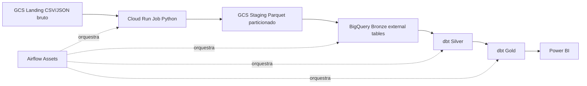

# Pipeline de Deteccao de Fraude - iGaming

Projeto para o case tecnico de Engenharia de Dados, Observabilidade e Deteccao de Fraudes. A solucao le dados CSV/JSON da landing no GCS, converte para Parquet na staging, cria Bronze no BigQuery, transforma com dbt em Silver/Gold e orquestra tudo com Airflow usando Assets.

## Arquitetura



Camadas:

| Camada | Responsabilidade |
|---|---|
| Landing | Arquivos brutos CSV/JSON recebidos no bucket `case-grupo-otg1/landing`. |
| Staging | Arquivos Parquet particionados salvos no bucket `case-grupo-otg1/staging`. |
| Bronze | Tabelas externas BigQuery apontando para a staging, com tipagem minima. |
| Silver | Limpeza, casting, normalizacao, deduplicacao/agregacao e testes estruturais via dbt. |
| Gold | Marts para fraude, performance de afiliados e sinais financeiros. |

## Bases e Cargas

| Dataset | Formato | Frequencia | Tipo | Campo incremental | Justificativa |
|---|---|---|---|---|---|
| `players` | JSON array | diaria | incremental | `created_at` | Cadastro muda menos e pode ser carregado por data de criacao. |
| `sessions` | JSON array | horaria | incremental | `timestamp` | Comportamento de acesso e IP/dispositivo e relevante para fraude. |
| `transactions` | CSV | horaria | incremental | `timestamp` | Movimentacoes financeiras exigem atualizacao frequente. |
| `affiliate_cpa_ftd` | CSV | diaria | full tecnico | `ingest_date` | A fonte nao possui data de evento; a particao tecnica controla reprocessamentos. |

## Estrutura

```text
airflow/                    # Astro Airflow e DAG factories
dbt/                        # Projeto dbt BigQuery
ddl/datasets/               # YAMLs de datasets BigQuery
ddl/tables/                 # DDLs de tabelas BigQuery aplicados via CI/CD
jobs/case                   # Cloud Run Job Python CSV/JSON -> Parquet
.github/workflows/          # CI/CD para BigQuery, dbt e jobs Python
tests/jobs/                 # Pytest do job de landing
```

## Jobs Python

O job `jobs/case` usa uma estrutura simples com Adapter e Repository:

| Classe | Papel |
|---|---|
| `ParquetTransformer` | Interface que define o contrato para transformar uma fonte em Parquet. |
| `CsvAdapter` | Le CSV da landing e transforma em batches Parquet. |
| `JsonAdapter` | Le JSON array da landing com `ijson` e transforma em batches Parquet. |
| `GCSRepository` | Recebe batches Parquet e salva na staging no Cloud Storage. |
| `TableConfig` e normalizers | Definem schema PyArrow, colunas obrigatorias e conversao de tipos por tabela. |
| `main.py` | Entry point invocado quando o container sobe. |

Exemplo local:

```bash
TABLE_NAME=transactions \
SOURCE_URI=/home/guilherme/Downloads/desfaio-tecnico/BASES_CASE/transactions.csv \
DESTINATION_URI=/tmp/staging/transactions \
BATCH_SIZE=1000 \
PYTHONPATH=jobs/case python jobs/case/main.py
```

Em Cloud Run, o `main.py` usa variaveis de ambiente. Se nada for sobrescrito, ele assume `gs://case-grupo-otg1/landing/<arquivo>` como origem e `gs://case-grupo-otg1/staging/<tabela>` como destino.

Observacao: Parquet e colunar, entao gravar literalmente uma linha por arquivo nao e eficiente. A solucao le uma linha por vez e grava micro-batches controlados por `BATCH_SIZE`, preservando baixo consumo de RAM.

## dbt

Modelos principais:

| Camada | Modelos |
|---|---|
| Bronze | `brz_players`, `brz_sessions`, `brz_transactions`, `brz_affiliate_cpa_ftd` |
| Silver | `slv_players`, `slv_sessions`, `slv_transactions`, `slv_affiliate_cpa_ftd` |
| Gold | `gold_fraud_overview`, `gold_affiliate_metrics`, `gold_financial_signals` |

Testes dbt incluem `not_null`, `unique`, `relationships`, `accepted_values`, unicidade composta e testes singulares para metricas nao negativas, consistencia de flags e score de fraude.

Comandos:

```bash
cd dbt
dbt deps --profiles-dir .
dbt parse --profiles-dir .
dbt build --select tag:silver --profiles-dir .
dbt build --select tag:gold --profiles-dir .
```

## Sinais de Fraude na Gold

`gold_fraud_overview` consolida sinais por player:

| Sinal | Logica |
|---|---|
| IP compartilhado | Mesmo IP associado a muitos players. |
| Muitos dispositivos | Player acessando por varios tipos de device. |
| Saque elevado | Saque total muito acima dos depositos. |
| Velocidade de aposta | Volume de apostas muito alto em relacao aos depositos. |
| Funil de afiliado anomalo | `registrations > clicks` ou `ftd > registrations`. |

`gold_affiliate_metrics` alimenta analises de afiliado, conversao, CPA estimado e anomalias de funil. `gold_financial_signals` alimenta paineis de depositos, saques, apostas e ratios financeiros.

## Airflow

As DAGs sao geradas por factories em `airflow/dags/case`:

| Camada | Padrao de DAG |
|---|---|
| Landing/Staging | `case_landing_<tabela>` executa Cloud Run Job Python, le landing bruta e publica Asset da staging. |
| Bronze | `case_bronze_<tabela>` valida a tabela externa criada via CI/CD e publica Asset BQ. |
| Silver | `case_silver_<tabela>` executa `dbt build --select slv_*` no Cloud Run. |
| Gold | `case_gold_<modelo>` executa `dbt build --select gold_*` apos os Datasets Silver necessarios. |

Variaveis Airflow esperadas:

```text
case_gcp_project_id
case_gcp_region
case_bigquery_location
case_gcs_bucket
case_bronze_dataset
case_landing_job_name
case_dbt_job_name
case_dbt_target
case_players_source_uri
case_sessions_source_uri
case_transactions_source_uri
case_affiliate_source_uri
```

## CI/CD

Workflows:

| Workflow | Responsabilidade |
|---|---|
| `.github/workflows/deploy-bigquery-ddl.yml` | Cria datasets BigQuery a partir de YAMLs e aplica DDLs SQL alterados. |
| `.github/workflows/deploy-dbt-cloud-run.yml` | Builda a imagem dbt, valida com `dbt parse`, faz push no Artifact Registry e deploya o Cloud Run Job do dbt. |
| `.github/workflows/deploy-jobs-cloud-run.yml` | Roda pytest, detecta subpastas alteradas em `jobs/`, builda uma imagem por job e deploya Cloud Run Jobs separados. |

Autenticacao recomendada: Workload Identity Federation.

Secrets:

```text
GCP_WORKLOAD_IDENTITY_PROVIDER
GCP_GITHUB_ACTIONS_SERVICE_ACCOUNT
```

Repository variables:

```text
GCP_PROJECT_ID
GCP_REGION
DBT_ARTIFACT_REGISTRY_REPOSITORY
JOBS_ARTIFACT_REGISTRY_REPOSITORY
DBT_IMAGE_NAME
DBT_CLOUD_RUN_JOB
DBT_RUNTIME_SERVICE_ACCOUNT
```

## Observabilidade

Pontos monitoraveis:

| Area | Indicadores |
|---|---|
| Airflow | status das DAGs, retries, duracao por camada, publicacao de Datasets. |
| Cloud Run | logs, memoria, CPU, tempo de execucao, exit code. |
| BigQuery | bytes processados, duracao dos jobs, volume de linhas, freshness. |
| dbt | `run_results.json`, `manifest.json`, falhas de testes, docs. |

## Dashboard Power BI

Tabelas Gold sugeridas para o Power BI:

| Pagina | Tabelas | Indicadores |
|---|---|---|
| Fraud Overview | `gold_fraud_overview` | score de risco, flags por player, IP compartilhado, dispositivos, cidade. |
| Affiliate Metrics | `gold_affiliate_metrics` | clicks, registrations, FTD, CPA estimado, taxas de conversao, funil anomalo. |
| Financial Signals | `gold_financial_signals` | depositos, saques, apostas, saque/deposito, aposta/deposito. |

## Validacao Local

```bash
PYENV_VERSION=3.12.4 python -m venv .venv312
.venv312/bin/pip install -r requirements-dev.txt
.venv312/bin/pytest -q

cd dbt
PYENV_VERSION=3.12.4 dbt deps --profiles-dir .
PYENV_VERSION=3.12.4 dbt parse --profiles-dir .
```

Validado neste workspace:

```text
pytest: 5 passed
dbt parse: sucesso com dbt 1.8.0
```

## Limitacoes e Proximos Passos

- Os dados sao sinteticos, entao as regras de fraude sao heuristicas.
- `affiliate_cpa_ftd` nao possui timestamp de evento; para producao, a fonte deveria enviar data de referencia.
- O dashboard Power BI nao esta versionado neste repositorio, mas a camada Gold esta preparada para conexao.
- Proximos passos: dbt docs, freshness tests, alertas de falha, data contracts e score de fraude com pesos configuraveis.
