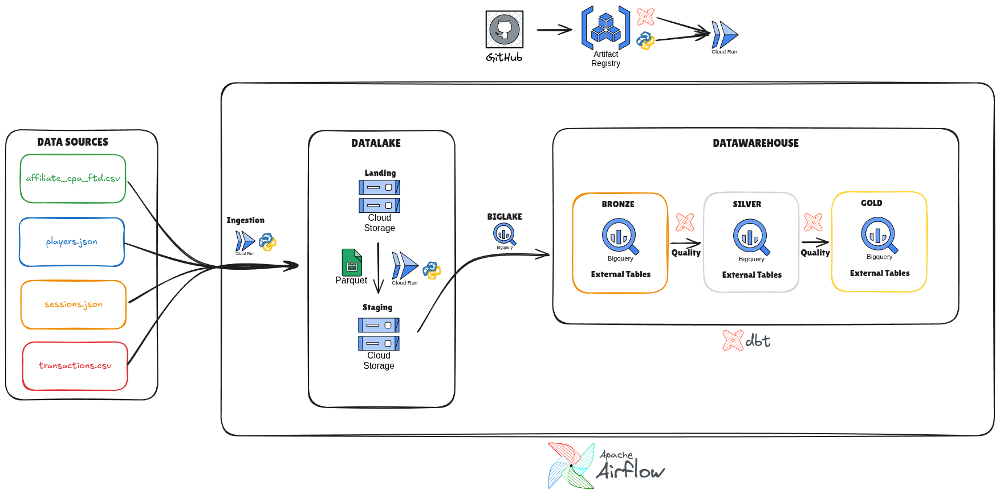

# Pipeline de Deteccao de Fraude

Projeto desenvolvido para o case tecnico de Engenharia de Dados, Observabilidade e Deteccao de Fraudes. A solucao ingere arquivos CSV/JSON, converte para Parquet, disponibiliza tabelas Bronze no BigQuery, transforma os dados com dbt em Silver/Gold e orquestra tudo com Airflow/Astronomer.

## Sumario

- [Arquitetura](#arquitetura)
- [Stack](#stack)
- [Estrutura do Projeto](#estrutura-do-projeto)
- [Configuracao GCP e GitHub Actions](#configuracao-gcp-e-github-actions)
- [Free Tier da GCP](#free-tier-da-gcp)
- [Subir o Airflow Local com Astronomer](#subir-o-airflow-local-com-astronomer)
- [Rodar dbt Local](#rodar-dbt-local)
- [Rodar o Job Python Local](#rodar-o-job-python-local)
- [BigQuery DDL](#bigquery-ddl)
- [Orquestracao Airflow](#orquestracao-airflow)
- [Modelagem dbt](#modelagem-dbt)
- [Definicao de Cargas](#definicao-de-cargas)
- [Observabilidade](#observabilidade)
- [Sinais de Fraude](#sinais-de-fraude)
- [Dashboard Power BI](#dashboard-power-bi)
- [Respostas ao Desafio](#respostas-ao-desafio)
- [Troubleshooting](#troubleshooting)
- [Validacao Local](#validacao-local)

## Arquitetura



Fluxo implementado:

```text
GCS Landing CSV/JSON
  -> Cloud Run Job Python
  -> GCS Staging Parquet particionado
  -> BigQuery Bronze external tables
  -> dbt Silver
  -> dbt Gold
  -> Power BI
```

Camadas:

| Camada | Responsabilidade |
|---|---|
| Landing | Arquivos brutos em `gs://case-grupo-otg1/landing`. |
| Staging | Arquivos Parquet particionados em `gs://case-grupo-otg1/staging`. |
| Bronze | Tabelas externas BigQuery sobre os Parquets, declaradas como `source()` no dbt. |
| Silver | Limpeza, casting, normalizacao, deduplicacao, incremental e testes de qualidade. |
| Gold | Marts analiticos para fraude, afiliados e sinais financeiros. |

## Stack

| Componente | Uso |
|---|---|
| Airflow 3 / Astronomer | Orquestracao das DAGs por camada e por tabela. |
| Cloud Run Jobs | Execucao do conversor Python e do dbt em containers. |
| Cloud Storage | Landing de arquivos brutos e staging em Parquet. |
| BigQuery | Bronze, Silver e Gold. |
| dbt | Transformacao, testes e documentacao logica dos modelos. |
| GitHub Actions | CI/CD para DDL, dbt e jobs Python. |
| Workload Identity Federation | Autenticacao GitHub Actions -> GCP sem chave JSON. |

## Estrutura do Projeto

```text
airflow/                    # Projeto Astro Airflow
airflow/dags/case           # Factories de DAGs bronze, silver e gold
airflow/include             # Config, Assets e TaskGroups reutilizaveis
dbt/                        # Projeto dbt BigQuery
dbt/models/bronze/case      # Sources bronze e testes simples
dbt/models/silver/case      # Modelos Silver
dbt/models/gold/case        # Modelos Gold
ddl/datasets                # YAMLs de datasets BigQuery
ddl/tables                  # DDLs das tabelas externas Bronze
jobs/case/parquet_converter # Cloud Run Job Python CSV/JSON -> Parquet
.github/workflows           # CI/CD
tests/jobs                  # Testes unitarios do job Python
```

## Configuracao GCP e GitHub Actions

Este projeto usa Workload Identity Federation para permitir que o GitHub Actions acesse a GCP sem armazenar chave JSON.

Valores usados:

```bash
PROJECT_ID="case-grupo-otg1"
PROJECT_NUMBER="712304487497"
REGION="us-central1"
POOL_ID="github-pool"
PROVIDER_ID="github-provider"
SA_EMAIL="case-594@case-grupo-otg1.iam.gserviceaccount.com"
GITHUB_ORG="Gui-mp8"
GITHUB_REPO="pipeline_deteccao_fraude"
ARTIFACT_REGISTRY_REPOSITORY="gar-imagens"
```

### 1. Definir variaveis no Cloud Shell

```bash
export PROJECT_ID="case-grupo-otg1"
export PROJECT_NUMBER="$(gcloud projects describe $PROJECT_ID --format='value(projectNumber)')"
export REGION="us-central1"
export POOL_ID="github-pool"
export PROVIDER_ID="github-provider"
export SA_EMAIL="case-594@case-grupo-otg1.iam.gserviceaccount.com"
export GITHUB_ORG="Gui-mp8"
export GITHUB_REPO="pipeline_deteccao_fraude"

gcloud config set project $PROJECT_ID
```

### 2. Habilitar APIs

```bash
gcloud services enable \
  iamcredentials.googleapis.com \
  cloudresourcemanager.googleapis.com \
  iam.googleapis.com \
  serviceusage.googleapis.com \
  artifactregistry.googleapis.com \
  cloudbuild.googleapis.com \
  run.googleapis.com \
  bigquery.googleapis.com \
  storage.googleapis.com \
  --project=$PROJECT_ID
```

### 3. Criar Workload Identity Pool

```bash
gcloud iam workload-identity-pools create $POOL_ID \
  --project=$PROJECT_ID \
  --location="global" \
  --display-name="GitHub Actions Pool"
```

Se retornar `ALREADY_EXISTS`, o pool ja existe.

### 4. Criar Provider OIDC do GitHub

```bash
gcloud iam workload-identity-pools providers create-oidc $PROVIDER_ID \
  --project=$PROJECT_ID \
  --location="global" \
  --workload-identity-pool=$POOL_ID \
  --display-name="GitHub Provider" \
  --attribute-mapping="google.subject=assertion.sub,attribute.actor=assertion.actor,attribute.repository=assertion.repository,attribute.repository_owner=assertion.repository_owner" \
  --attribute-condition="assertion.repository == '${GITHUB_ORG}/${GITHUB_REPO}'" \
  --issuer-uri="https://token.actions.githubusercontent.com"
```

Validar:

```bash
gcloud iam workload-identity-pools providers describe $PROVIDER_ID \
  --project=$PROJECT_ID \
  --location="global" \
  --workload-identity-pool=$POOL_ID
```

O provider usado nos workflows deve ser:

```text
projects/712304487497/locations/global/workloadIdentityPools/github-pool/providers/github-provider
```

### 5. Permitir impersonacao da Service Account

```bash
gcloud iam service-accounts add-iam-policy-binding "$SA_EMAIL" \
  --project=$PROJECT_ID \
  --role="roles/iam.workloadIdentityUser" \
  --member="principalSet://iam.googleapis.com/projects/$PROJECT_NUMBER/locations/global/workloadIdentityPools/$POOL_ID/attribute.repository/$GITHUB_ORG/$GITHUB_REPO"
```

### 6. Permissoes da Service Account

Permissoes minimas usadas no case:

```bash
gcloud projects add-iam-policy-binding $PROJECT_ID \
  --member="serviceAccount:$SA_EMAIL" \
  --role="roles/viewer"

gcloud projects add-iam-policy-binding $PROJECT_ID \
  --member="serviceAccount:$SA_EMAIL" \
  --role="roles/run.admin"

gcloud projects add-iam-policy-binding $PROJECT_ID \
  --member="serviceAccount:$SA_EMAIL" \
  --role="roles/bigquery.admin"

gcloud projects add-iam-policy-binding $PROJECT_ID \
  --member="serviceAccount:$SA_EMAIL" \
  --role="roles/storage.admin"

gcloud iam service-accounts add-iam-policy-binding "$SA_EMAIL" \
  --project=$PROJECT_ID \
  --member="serviceAccount:$SA_EMAIL" \
  --role="roles/iam.serviceAccountUser"
```

Para Artifact Registry:

```bash
gcloud artifacts repositories create gar-imagens \
  --repository-format=docker \
  --location=$REGION \
  --description="Imagens Docker do case de fraude" \
  --project=$PROJECT_ID

gcloud artifacts repositories add-iam-policy-binding gar-imagens \
  --location=$REGION \
  --project=$PROJECT_ID \
  --member="serviceAccount:$SA_EMAIL" \
  --role="roles/artifactregistry.writer"
```

### 7. Configurar GitHub

Em `Settings -> Secrets and variables -> Actions`, configure:

Secrets ou variables:

```text
GCP_WORKLOAD_IDENTITY_PROVIDER=projects/712304487497/locations/global/workloadIdentityPools/github-pool/providers/github-provider
GCP_GITHUB_ACTIONS_SERVICE_ACCOUNT=case-594@case-grupo-otg1.iam.gserviceaccount.com
```

Repository variables opcionais:

```text
GCP_PROJECT_ID=case-grupo-otg1
GCP_REGION=us-central1
DBT_ARTIFACT_REGISTRY_REPOSITORY=gar-imagens
JOBS_ARTIFACT_REGISTRY_REPOSITORY=gar-imagens
DBT_IMAGE_NAME=fraud-dbt
DBT_CLOUD_RUN_JOB=fraud-dbt
DBT_RUNTIME_SERVICE_ACCOUNT=case-594@case-grupo-otg1.iam.gserviceaccount.com
```

Permissao obrigatoria nos workflows:

```yaml
permissions:
  contents: read
  id-token: write
```

### 8. Workflows disponiveis

| Workflow | Quando roda | O que faz |
|---|---|---|
| `deploy-bigquery-ddl.yml` | `push` na `main` com alteracao em `ddl/**` ou manual | Cria datasets e aplica DDLs BigQuery. |
| `deploy-dbt-cloud-run.yml` | `push` na `main` com alteracao em `dbt/**`, Dockerfile ou entrypoint | Builda imagem dbt, roda `dbt parse`, publica no Artifact Registry e deploya Cloud Run Job `fraud-dbt`. |
| `deploy-jobs-cloud-run.yml` | `push` na `main` com alteracao em `jobs/**` ou manual | Roda pytest, builda jobs Python alterados e deploya Cloud Run Jobs. |

## Free Tier da GCP

O projeto foi desenhado para ficar leve e reduzir custo em ambiente de teste. Ainda assim, os limites gratuitos podem mudar com o tempo, entao antes de executar em uma conta real e importante conferir a pagina oficial de precos da GCP.

Servicos usados e cuidados de custo:

| Servico | Uso no projeto | Estrategia para baixo custo |
|---|---|---|
| Cloud Run Jobs | Executa o conversor Python e o dbt em containers sob demanda. | Jobs so rodam quando chamados pela DAG/CI, com `512Mi`, `1 CPU`, `1 task` e timeout controlado. |
| Artifact Registry | Armazena imagens Docker dos jobs e do dbt. | Usa um unico repositorio `gar-imagens`; imagens pequenas e tags por commit. |
| Cloud Storage | Guarda landing CSV/JSON e staging Parquet. | Arquivos pequenos, Parquet comprimido com Snappy e limpeza do prefixo staging antes de nova carga. |
| BigQuery | Bronze externa, Silver e Gold. | Bronze como external table evita carga fisica inicial; Silver incremental reduz reprocessamento; queries Bronze usam filtro de particao. |
| GitHub Actions | CI/CD fora da GCP. | Executa apenas em alteracoes de caminho especifico e workflow manual quando necessario. |
| Airflow local | Orquestracao em ambiente local Astronomer. | Roda localmente via Docker, sem custo GCP para scheduler/webserver. |

Boas praticas aplicadas:

- Usar Cloud Run Jobs em vez de servicos sempre ligados.
- Ler arquivos linha a linha e gravar Parquet em batches para reduzir memoria.
- Manter `BATCH_SIZE` configuravel.
- Usar tabelas externas Bronze sobre Parquet particionado.
- Exigir filtro de particao Hive na Bronze.
- Usar incremental na Silver para evitar processar todo o historico.
- Limpar a staging da tabela antes de escrever nova carga para evitar duplicidade e crescimento desnecessario.
- Separar workflows por escopo: DDL, dbt e jobs Python.

## Subir o Airflow Local com Astronomer

Instale a Astro CLI e Docker. Dentro da pasta do projeto:

```bash
cd airflow
astro dev start
```

Servicos locais:

```text
Airflow UI: http://localhost:8080
Usuario: admin
Senha: admin
Postgres: localhost:5432/postgres
```

Comandos uteis:

```bash
astro dev ps
astro dev logs --webserver
astro dev logs --scheduler
astro dev restart
astro dev stop
```

Se a porta `8080` ou `5432` ja estiver ocupada, pare o container conflitante ou ajuste a porta do Astro.

### Conexao GCP no Airflow local

O `conn_id` esperado pelas DAGs e:

```text
google_cloud_default
```

Na UI do Airflow:

```text
Admin -> Connections -> Add/Edit
Connection Id: google_cloud_default
Connection Type: Google Cloud
Project Id: case-grupo-otg1
Keyfile JSON: conteudo do JSON da Service Account, se estiver usando chave local
```

Tambem e possivel usar ADC local:

```bash
gcloud auth application-default login
gcloud config set project case-grupo-otg1
```

Para testar a conexao, use a DAG `test_gcp_connection`.

## Rodar dbt Local

Instale dependencias do dbt em um ambiente Python:

```bash
python -m venv .venv
source .venv/bin/activate
pip install dbt-bigquery dbt-core
```

Rodar do diretorio raiz:

```bash
dbt deps --project-dir dbt --profiles-dir dbt
dbt parse --project-dir dbt --profiles-dir dbt --target dev
dbt build --project-dir dbt --profiles-dir dbt --target dev --select slv_players
dbt build --project-dir dbt --profiles-dir dbt --target dev --select tag:silver
dbt build --project-dir dbt --profiles-dir dbt --target dev --select tag:gold
```

Para reconstruir uma incremental com estado antigo:

```bash
dbt build --project-dir dbt --profiles-dir dbt --target dev --select slv_players --full-refresh
```

O perfil local esta em `dbt/profiles.yml` e usa:

```text
project: case-grupo-otg1
dataset: case_silver
location: us-central1
```

## Rodar o Job Python Local

Instale dependencias:

```bash
python -m venv .venv
source .venv/bin/activate
pip install -r requirements-dev.txt
```

Exemplo usando GCS:

```bash
TABLE_NAME=transactions \
SOURCE_URI=gs://case-grupo-otg1/landing/transactions.csv \
DESTINATION_URI=gs://case-grupo-otg1/staging/transactions \
BATCH_SIZE=1000 \
PYTHONPATH=jobs/case/parquet_converter \
python jobs/case/parquet_converter/main.py
```

No Cloud Run, a DAG passa a tabela e o job assume os caminhos:

```text
Landing: gs://case-grupo-otg1/landing/<arquivo>
Staging: gs://case-grupo-otg1/staging/<tabela>
```

O repository limpa o prefixo da tabela na staging antes de salvar os novos Parquets, tornando a carga idempotente para evitar duplicidade em tabelas externas.

## BigQuery DDL

Datasets:

```text
case_bronze
case_silver
case_gold
```

Arquivos:

```text
ddl/datasets/*.yaml
ddl/tables/*.sql
```

A Bronze usa external tables sobre Parquet com Hive partition e `REQUIRE_HIVE_PARTITION_FILTER = TRUE`.

Para aplicar manualmente:

```bash
bq --project_id=case-grupo-otg1 query --use_legacy_sql=false < ddl/tables/case_bronze_players.sql
```

## Orquestracao Airflow

As DAGs sao geradas por tabela/modelo:

| Camada | Padrao | Responsabilidade |
|---|---|---|
| Bronze | `case_bronze_<tabela>` | Executa Cloud Run Job Python para converter landing em Parquet. |
| Silver | `case_silver_<tabela>` | Primeiro roda checks da source bronze, depois executa `dbt build --select slv_<tabela>`. |
| Gold | `case_gold_<modelo>` | Executa `dbt build --select gold_<modelo>` apos Assets Silver necessarios. |

Dependencias usam Airflow Assets:

```text
Bronze Asset -> Silver DAG -> Silver Asset -> Gold DAG
```

TaskGroups reutilizaveis:

| TaskGroup | Uso |
|---|---|
| `TaskStrategyLandingToBronzeCloudRunTG` | Invoca Cloud Run Job Python da Bronze. |
| `TaskStrategyDbtChecksCloudRunTG` | Executa testes dbt antes da transformacao. |
| `TaskStrategyDbtCloudRunTG` | Executa dbt no Cloud Run Job. |

## Modelagem dbt

| Camada | Objetos |
|---|---|
| Bronze | Sources `case_bronze.players`, `sessions`, `transactions`, `affiliate_cpa_ftd`. |
| Silver | `slv_players`, `slv_sessions`, `slv_transactions`, `slv_affiliate_cpa_ftd`. |
| Gold | `gold_fraud_overview`, `gold_affiliate_metrics`, `gold_financial_signals`. |

Silver:

| Modelo | Grain | Incremental |
|---|---|---|
| `slv_players` | 1 linha por `player_id` | `created_at` |
| `slv_sessions` | 1 linha por `session_id` | `timestamp` |
| `slv_transactions` | 1 linha por `transaction_id` | `timestamp` |
| `slv_affiliate_cpa_ftd` | afiliado + player + pais | tabela agregada/full tecnico |

Testes:

| Camada | Testes |
|---|---|
| Bronze/source | `not_null` em IDs e particoes. |
| Silver | `not_null`, `unique`, `relationships`, `accepted_values`. |
| Gold | Unicidade, combinacao unica e testes singulares de metricas/flags. |

## Definicao de Cargas

| Dataset | Frequencia | Tipo | Campo de controle | Justificativa |
|---|---|---|---|---|
| `players.json` | Diaria | Incremental | `created_at` | Cadastro muda menos; carga diaria reduz custo e atende analises cadastrais. |
| `sessions.json` | Horaria | Incremental | `timestamp` | Sessoes sao importantes para fraude comportamental, IP e device. |
| `transactions.csv` | Horaria | Incremental | `timestamp` | Movimentacoes financeiras precisam de atualizacao frequente. |
| `affiliate_cpa_ftd.csv` | Diaria | Full tecnico na staging e agregacao na Silver | `ingest_date` | A fonte nao possui data de evento; a particao tecnica controla reprocessamento. |

## Observabilidade

Pontos de observabilidade:

| Area | O que observar |
|---|---|
| Airflow | Status das DAGs, duracao, retries, falhas por camada, eventos de Assets. |
| Cloud Run Jobs | Exit code, memoria, CPU, tempo de execucao, logs estruturados. |
| BigQuery | Jobs executados, bytes processados, erros de particao, volume de linhas. |
| dbt | Falhas de testes, `run_results.json`, modelos quebrados, lineage e docs. |
| Dados | Contagem de linhas por camada, unicidade na Silver, nao nulos, relacionamentos. |

Queries uteis:

```sql
SELECT COUNT(*) AS total_linhas
FROM `case-grupo-otg1.case_bronze.players`
WHERE dt >= DATE('1900-01-01');
```

```sql
SELECT player_id, COUNT(*) AS qtd
FROM `case-grupo-otg1.case_silver.slv_players`
GROUP BY player_id
HAVING COUNT(*) > 1;
```

## Sinais de Fraude

A camada Gold permite detectar pelo menos estes sinais:

| Sinal | Regra |
|---|---|
| IP compartilhado | Muitos players usando o mesmo IP. |
| Muitos devices | Mesmo player acessando por muitos dispositivos. |
| Saque elevado | `withdraw_amount` muito maior que `deposit_amount`. |
| Aposta elevada | `bet_amount` muito alto em relacao ao deposito. |
| Funil de afiliado anomalo | `registrations > clicks` ou `ftd > registrations`. |

Modelos Gold:

| Modelo | Uso |
|---|---|
| `gold_fraud_overview` | Visao por player com flags e score de risco. |
| `gold_affiliate_metrics` | Performance de afiliados, conversao, FTD e custo CPA. |
| `gold_financial_signals` | Indicadores financeiros por player. |

## Dashboard Power BI

Paginas sugeridas:

| Pagina | Indicadores |
|---|---|
| Fraud Overview | Players por score de risco, flags ativas, IP compartilhado, devices por player, cidade. |
| Affiliate Metrics | Clicks, registrations, FTD, taxa de conversao, CPA estimado, anomalias de funil. |
| Financial Signals | Depositos, saques, apostas, razao saque/deposito, razao aposta/deposito. |

Conexao recomendada: Power BI conectado diretamente nas tabelas `case_gold`.

## Respostas ao Desafio

| Item pedido | Resposta no projeto |
|---|---|
| Arquitetura Medallion | Landing, Staging, Bronze, Silver e Gold descritas neste README e implementadas no repo. |
| Airflow | DAGs por camada/tabela em `airflow/dags/case`, com Assets e TaskGroups. |
| dbt | Sources Bronze, modelos Silver e Gold organizados por pasta `case`. |
| BigQuery | Datasets e DDLs versionados em `ddl/`. |
| Definicao de cargas | Tabela de frequencia, tipo e justificativa na secao "Definicao de Cargas". |
| Observabilidade | Airflow, Cloud Run, BigQuery, dbt e qualidade de dados descritos na secao propria. |
| Fraude | Gold possui sinais de IP compartilhado, multiplos devices, saque/aposta anomala e funil de afiliado. |
| Dashboard | Estrutura recomendada para Power BI usando as tabelas Gold. |
| CI/CD | GitHub Actions com Workload Identity Federation para DDL, dbt e jobs Python. |

## Troubleshooting

Erro de provider deletado:

```text
invalid_target ... pool or provider is disabled or deleted
```

Recrie o provider OIDC e confira se o `state` nao esta `DELETED`.

Erro `iam.serviceaccounts.actAs`:

```text
Permission 'iam.serviceaccounts.actAs' denied
```

Conceda:

```bash
gcloud iam service-accounts add-iam-policy-binding "$SA_EMAIL" \
  --project=$PROJECT_ID \
  --member="serviceAccount:$SA_EMAIL" \
  --role="roles/iam.serviceAccountUser"
```

Erro de particao na Bronze:

```text
Cannot query over table ... without a filter over column(s) 'dt'
```

As queries sobre Bronze precisam filtrar a particao Hive:

```sql
WHERE dt >= DATE('1900-01-01')
```

Erro de unique na Silver:

```text
Got N results, configured to fail if != 0
```

O teste dbt retorna as linhas invalidas. Para teste passar, deve retornar zero. Se a tabela incremental ficou com estado antigo, rode:

```bash
dbt build --project-dir dbt --profiles-dir dbt --target dev --select slv_players --full-refresh
```

## Validacao Local

```bash
python -m py_compile \
  airflow/dags/case/dag_factory_silver.py \
  jobs/case/parquet_converter/main.py \
  jobs/case/parquet_converter/src/repository/gcs_repository.py

dbt parse --project-dir dbt --profiles-dir dbt --target dev --quiet
```

Testes Python:

```bash
pip install -r requirements-dev.txt
pytest -q
```
